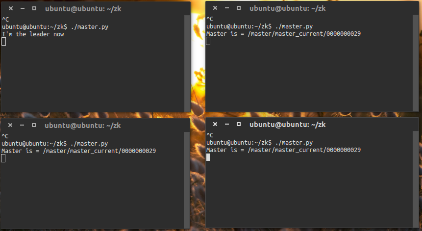
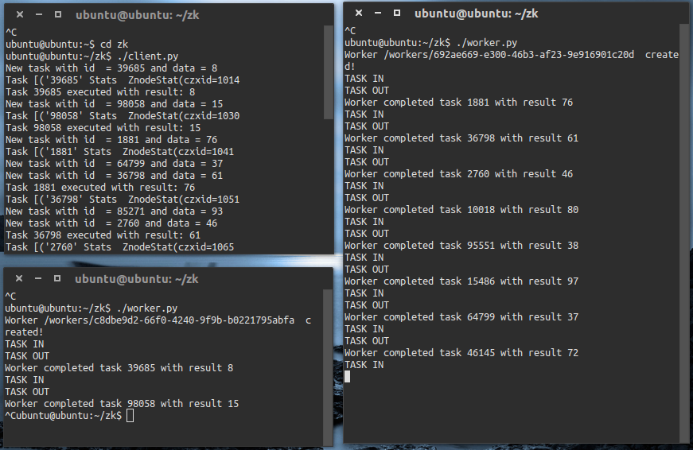
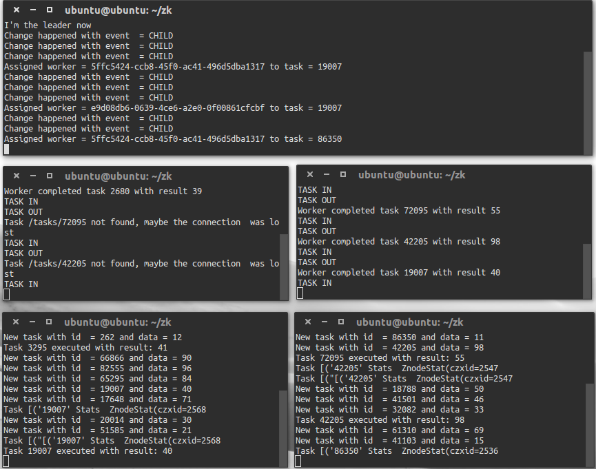

# Cloud Computing Systems 2016 - ZooKeeper

## General feedback

Just like in first mini-project, you rocked again with the idea! Great! We really enjoyed working on this project. Eventhough we had a lot of other projcets and deadlines, we really had fun with this.
Because almost everything was new to us, starting from Python, Kazoo, Zookeeper, etc., we have learnt a lot which actually is the purpose of our studies. We had difficulties during implementations but we tried to do our best and hopefully we are delivering something that meets your requirements.
ZooKeeper is a great software with clean and simple API. Thanks to the quality of documentation, examples and recipes we could write a distributed software.

## Implementation feedback

Below you can find implementation 

### 1.1 ZooKeeper service

The first thing we did after instatiating VM template was to make sure that Zookeper
service was up and running, and it was as you can see in the following screenshot


### 1.2 ZK-Shell 

We created the required permanent paths using ZK-Shell.
Paths: 
	* /tasks
	* /data
	* /master
	* /workers
 

### 1.3 Kazoo

The Kazoo's [API documentation](http://kazoo.readthedocs.io/en/latest/basic_usage.html) basic usage was very helpful and I think that's the only thing 
that was required to use(with some additions).
Also we tried some Kazoo basic functions and also the *kazoo_example.py*.

 
### 2 Leader Election

We completed the leader election class in election.py. We have followed carefuly the recipe in pseudo-code in [Leader Election](http://zookeeper.apache.org/doc/trunk/recipes.html#sc_leaderElection) section in ZooKeeper API documentation.
A simple way of doing leader election with ZooKeeper is to use the SEQUENCE|EPHEMERAL flags when creating znodes that represent "proposals" of clients. 

- Using Kazoo library to implement CRUD operations and set watchers we were able to do our code implementation in *Election* class. 
- We have run three instances of *Election* class and we were able to see that one of them was elected as leader.
- We also added handlers to catch and handle `SIGTERM` and `SIGINT` signals in the constructor of the election.py which in our case
  calls a function **kill_myself** which basically kills the znode if it's the master.

Here you can see some screenshots of **leader election**:


Here is what happens when one of the **master dies**:


### 3 Master/Worker Architecture

Here we tried to implement the master/worker architecture as you described in [Master/Worker Architecture](https://github.com/ljakupi/zk#3---masterworker-architecture) section.


#### 3.1 Master/Worker components
Here we implemented the master/worker architecture.

- We followed the requirements closely, setting watchers to the **/tasks** and **/workers**, we participate in election by calling 
  the election's ballot function:
  ```python   
  self.election = Election(zk, MASTER_PATH, my_path)
  self.election.ballot(self.zk.get_children(MASTER_PATH))
  ```
  When something changes on **/tasks** and **/workers** the function that we call is _assign_ (we defined it when we set the watchers):
  ```python
  zk.ChildrenWatch(WORKERS_PATH,self.assign, send_event=True)	
  zk.ChildrenWatch(TASKS_PATH, self.assign, send_event=True)
  ```
- We have completed the code in *client.py* in order to make the client able to submit tasks. 
- We have completed the code in *worker.py* in order to amke the worker able to retrieve a task and execute it by calling *utils.py*.
- We finally were able to complete the *master.py*. Here we bind workeres with tasks. *Master* class is responsible to assign tasks to the workers, then the workers process their tasks.

#### 3.2 Fault-Tolerance

In the following section we will provide the logs of our scenarios:

1.**(1C/1W/1M) a worker or a client fails;**
Client fails and is detected by the worker


2.**(1C/2W/1M) a worker fails;**
When a worker fails, the other one continues with the tasks.



3.**(2C/2W/1M) workers compete in executing the tasks submitted by the clients;**
We can clearly see how **workers** compete for different tasks and execute them in different orders.


4. **(2C/2W/2M) the back-up resumes the job of the master upon a failure.**
When master dies, the backup continues...



#### 3.3 ZooKeeper in Cluster Mode

We tried to test ZooKeeper in Cluster Mode, we instantiated 3 VM's and cloned our repository there.
And then we modified the `zookeper configuration file` to create 3 servers and what we observed was not to much
because we had lost to much time with other issues:

 * we could see that we can run clients in one server, workers on another and it would work just fine
 * changes where propagated to the other servers

